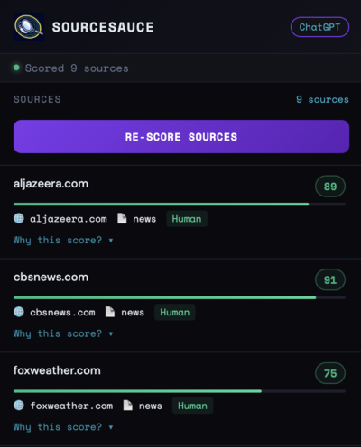

# SourceSauce – AI Source Credibility Analyzer



## The Problem

As AI language models like ChatGPT, Claude, and Gemini become central research assistants, users increasingly rely on the sources these models cite. Yet, all citations—whether from reputable outlets like Reuters or AI-generated content farms—appear identical in chat interfaces. This creates a serious risk: users may unknowingly trust low-credibility, AI-generated, or biased sources. Existing solutions are manual, slow, and cognitively taxing. No real-time tool exists to assess source credibility directly inside AI chat interfaces.

## Solution Overview

**SourceSauce** is a Chrome extension paired with a FastAPI backend that scores the credibility of every source cited by an AI chatbot, in real time, directly inside the chat interface. Each hyperlink gets a color-coded badge, and hovering reveals detailed reasoning behind the score. SourceSauce combines domain reputation, AI detection, content analysis, and intelligent caching to give users fast, actionable insights, helping millions cut through misinformation without leaving the chat.

## System Architecture

```
ChatGPT / Claude / Gemini (browser)
        │
        ▼
Chrome Extension (detects citations)
        │
        ▼
background.js (proxies requests)
        │
        ▼
FastAPI Backend (runs ML model in DigitalOcean droplet, caches data in MongoDB Atlas)
        │
        ├── services/fetcher.py       → Scrapes and normalizes article text
        ├── services/ai_detector.py   → RoBERTa-based AI content detection
        └── services/credibility.py   → Weighted scoring engine combining multiple signals
```

## Technical Components

### Chrome Extension

- **inject.js** — Intercepts fetch() calls and SSE streams to extract citation URLs from AI responses.
- **content_script.js** — Uses MutationObserver to detect new links, injects pending badges, and calls the backend for scoring.
- **background.js** — Proxies API requests to avoid CORS and ensures seamless backend communication.
- **popup.html / popup.js** — Dashboard showing all scored sources, AI authorship labels, and full reasoning breakdowns.

### Backend (FastAPI + Python)

- Deployed on **DigitalOcean Ubuntu 24.04 droplet** (4GB RAM, 2 vCPU).
- **/analyze_urls** endpoint handles lists of URLs in parallel using `ThreadPoolExecutor`.
- **services/fetcher.py** — Scrapes articles, cleans URLs, and enforces word count thresholds.
- **services/ai_detector.py** — Uses `Hello-SimpleAI/chatgpt-detector-roberta` to score AI authorship.
- **services/domain_trust.py** — Contains verified trust scores for 350+ domains.
- **services/credibility.py** — Weighted scoring engine combining AI detection, domain trust, content type, article length, and burstiness for a final credibility score.

### Scoring Example

```json
{
  "url": "https://www.reuters.com/...",
  "credibility_score": 81.5,
  "ai_probability": 0.08,
  "content_type": "news",
  "reasoning": [
    "Content appears human-written (92% confidence)",
    "reuters.com is a highly trusted source",
    "Recognized as a news source",
    "Substantive article length (743 words)",
    "High sentence variation suggests human authorship"
  ],
  "signals": {
    "ai_detection": 0.92,
    "domain_trust": 0.95,
    "content_type": 1.0,
    "length": 1.0,
    "burstiness": 0.71
  }
}
```

## MongoDB

MongoDB Atlas drives our intelligent caching system, storing analyzed URLs and multi-signal metadata. This enables sub-second credibility scoring, eliminates redundant computation, and scales seamlessly, making our real-time AI source validation fast, reliable and production-ready.

#### Caching

MongoDB caching cuts compute time by over 50%, reducing server load drastically and allowing the extension to serve millions of users efficiently. The sub-second retrieval from cache ensures real-time badge updates in the browser without users noticing any delay.

## DigitalOcean

We used a DigitalOcean droplet to power our FastAPI backend. Its lightweight, high-performance setup ensures streaming credibility scores appear instantly, even under heavy traffic, proving that sophisticated AI tools can run efficiently without massive cloud infrastructure.

## Impact & Innovation

- Empowers users to **trust sources instantly** while using AI chatbots.
- Flags **AI-generated content** and low-trust sources before users rely on them.
- Modular backend allows easy integration of new models, signals, or languages.
- Combines **real-time processing, multi-signal scoring, AI detection, and smart caching**, a full-stack solution addressing misinformation in AI research.

## Future Enhancements

- Ensemble AI detection models for higher accuracy (~85–90%).
- Sentence-level AI highlighting to pinpoint AI-generated content.
- Dynamic, API-driven domain trust list for automated updates.
- Support for non-English content with multilingual NLP models.
